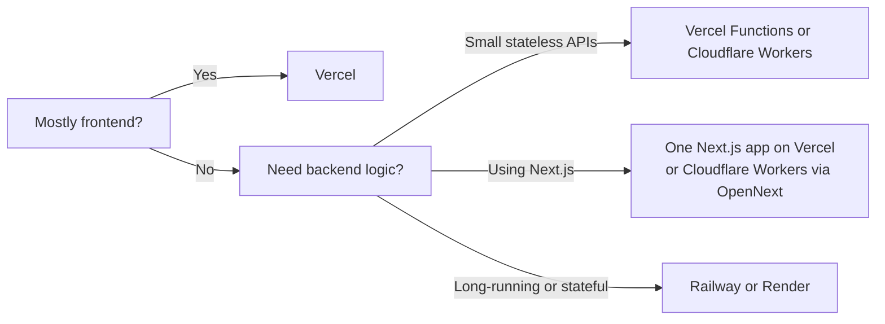

# Architecture first

## Choose the hosting model before the provider

---
layout: items
cols: 2
---

# Serverless vs Serverful

Traditional always-on machines vs newer on-demand compute

::items::

  <h2>Serverless</h2>
  <ul>
    <li>Newer default for many web apps</li>
    <li>Ephemeral: compute appears for work, then goes away</li>
    <li>Can run on many machines or regions behind the platform</li>
    <li>Usually cheaper when traffic is low because you pay per use</li>
  </ul>

  <h2>Serverful</h2>
  <ul>
    <li>Traditional model</li>
    <li>Always on: one server keeps running</li>
    <li>Usually tied to a specific machine or deployment location</li>
    <li>Costs money even while idle because the server stays up</li>
    <li>You manage a long-lived process that stays there over time</li>
  </ul>

---
layout: items
cols: 2
---

# Stateless vs stateful

::items::

  <h2>Stateless</h2>
  <ul>
    <li>Any request can land anywhere</li>
    <li>No important in-memory session state</li>
    <li>Easier to scale and restart</li>
    <li>Ideal for serverless</li>
  </ul>

  <h2>Stateful</h2>
  <ul>
    <li>Process memory or local state matters</li>
    <li>Harder to restart and distribute</li>
    <li>Shows up in queues and long jobs</li>
    <li>Use it only when the product needs it</li>
  </ul>

---
layout: fact
---

# Keep compute stateless by default.

---
layout: section
---

# Frontend deployment

Vercel first, Cloudflare Workers when you want a Cloudflare-first stack

---
layout: items
cols: 2
---

# Frontend platform comparison

::items::

  

    
    <strong>Vercel</strong> (Functions)
  

  <ul>
    <li>Excellent zero-config flow for React and Next.js</li>
    <li>300s wall-clock time per request</li>
    <li>1M requests & 100 GB-hours / month</li>
  </ul>

  

    
    <strong>Cloudflare Workers</strong>
  

  <ul>
    <li>Best to integrate with other Cloudflare products; DB, DNS, Zero Trust, etc.</li>
    <li>10 ms CPU time per request</li>
    <li>`100k` requests per day on free</li>
  </ul>

---

# Why not Cloudflare Pages?

- Cloudflare Pages is not yet deprecated
- But Cloudflare now defaults new projects to Cloudflare Workers, and provide new features and integrations only to it
- AI might say to use Pages, but that's a lie

---

# Next.js deployment choices

- Next.js can have a backend API server in it
- Vercel is still the smoothest default for the full Next.js feature set
- Cloudflare Workers works with OpenNext adapter; works fine in most cases
- Choose the single-app path when it reduces repo and deployment complexity

---

# If you separate frontend and backend

- Do it because the architecture needs it
- Good reasons: different runtimes, a Python API, independent scaling, or cleaner team boundaries
- Do not split just because “frontend and backend should always be separate”

---
layout: section
---

# Stateful backend SaaS

## Only for the workloads that cannot live happily in serverless

---

# When you actually need it

- Long-running jobs or background workers
- Heavy websocket or persistent-connection workloads (e.g. Discord Bot)
- Frameworks or libraries that assume a long-lived process
- Cases where cold starts or per-request limits become a real product issue

---
layout: items
cols: 2
---

# Stateful backend options

::items::

  

    
    <strong>Render</strong>
  

  <ul>
    <li>Free</li>
    <li>Free web services sleep after 15 min idle</li>
    <li>Expect a cold start (around 1 min)</li>
    <li>Good if students want a very low-cost first deploy</li>
  </ul>

  

    
    <strong>Railway</strong>
  

  <ul>
    <li>$5 USD Hobby is the cheapest useful always-on option here</li>
    <li>Free is credit-based, but $5 credit included in the plan should be enough for a minimal instance</li>
  </ul>

---

# Decision tree summary

